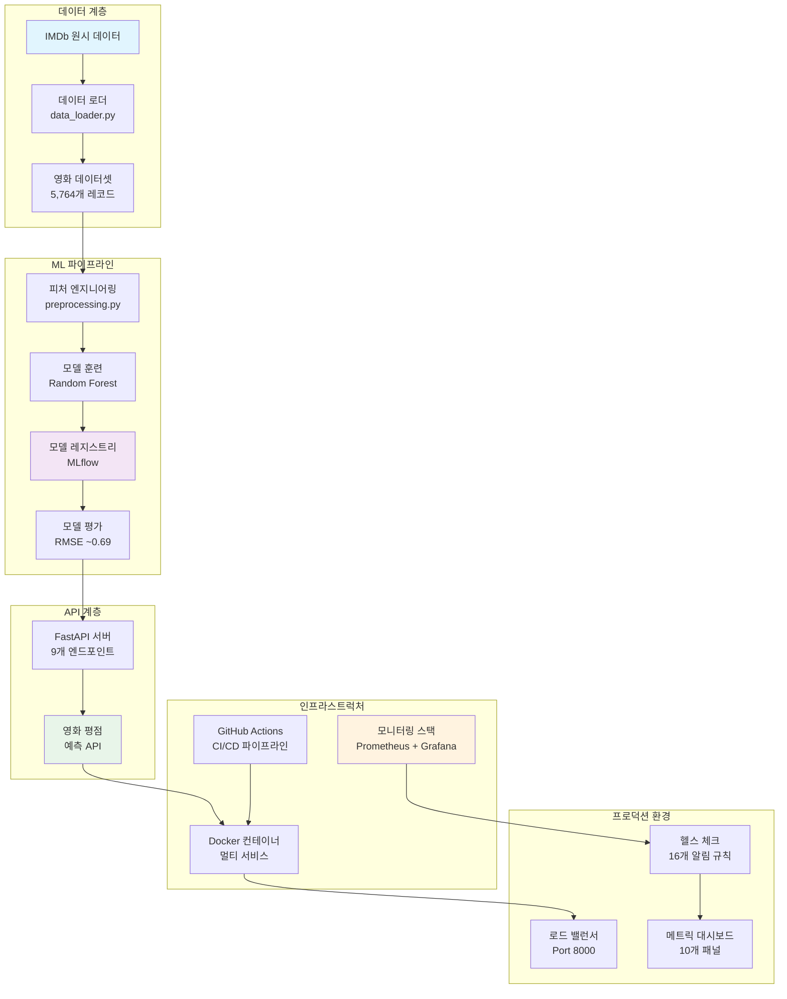
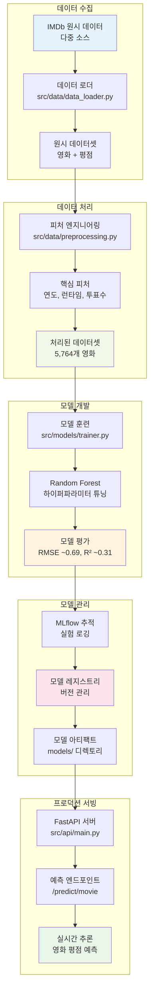

# 🎬 MLOps 영화 평점 예측 시스템

> **IMDb 영화 평점 예측을 위한 프로덕션 수준의 MLOps 파이프라인 - Random Forest 모델과 포괄적인 모니터링, CI/CD, 컨테이너화 구현**

[](https://github.com/Wchoi189/mlops-cloud-project-mlops_11/actions)
[](./docker/)
[](https://fastapi.tiangolo.com/)
[](https://mlflow.org/)
[](http://localhost:9090)
[](LICENSE)

## 📊 **프로젝트 현황**

- **🎯 데이터셋**: 5,764개 IMDb 영화 데이터 (포괄적 피처 포함)
- **🤖 모델**: Random Forest Regressor (RMSE ~0.69, R² ~0.31) 
- **🚀 API**: 9개 프로덕션 엔드포인트 (실시간 예측)
- **📈 모니터링**: 16개 이상의 알림 규칙 (Prometheus/Grafana 스택)
- **🐳 인프라**: 멀티 컨테이너 Docker 아키텍처
- **⚡ CI/CD**: 자동화된 테스트 및 배포 파이프라인

---

## 🏗️ **시스템 아키텍처**



## 🔄 **ML 파이프라인 흐름**



---

## 🚀 **빠른 시작** (3단계, ~5분)

### 1️⃣ **클론 및 설정**
```bash
git clone https://github.com/AIBootcamp13/mlops-cloud-project-mlops_11.git
cd mlops-cloud-project-mlops_11
python -m venv mlops-env && source mlops-env/bin/activate
pip install -r requirements.txt
```

### 2️⃣ **Docker로 실행**
```bash
# 전체 MLOps 스택 시작 (API + MLflow + 모니터링)
docker-compose -f docker/docker-compose.monitoring.yml up -d

# 서비스 정상 동작 확인
curl http://localhost:8000/health
```

### 3️⃣ **첫 번째 예측 실행**
```bash
curl -X POST "http://localhost:8000/predict/movie" \
  -H "Content-Type: application/json" \
  -d '{
    "startYear": 2010,
    "runtimeMinutes": 148,
    "numVotes": 2000000
  }'
```

**🎉 예상 결과**: `{"predicted_rating": 8.2, "confidence": "high", "model": "random_forest_v1.0"}`

---

## ✨ **주요 기능**

### 🤖 **머신러닝 기능**
- **고급 피처 엔지니어링**: 연도, 런타임, 인기도 기반 피처
- **견고한 모델**: 하이퍼파라미터 최적화가 적용된 Random Forest
- **성능 모니터링**: 실시간 모델 정확도 추적
- **실험 추적**: MLflow 통합 및 아티팩트 저장

### 🔌 **프로덕션 API**
- **9개 REST 엔드포인트**: 헬스 체크, 예측, 배치 처리
- **인터랙티브 문서**: `/docs`에서 자동 생성된 Swagger UI
- **입력 검증**: Pydantic 스키마 및 에러 핸들링
- **모니터링 지원**: 모든 요청에 대한 Prometheus 메트릭

### 📊 **관측성 스택** 
- **Prometheus**: 커스텀 메트릭 수집 (16개 이상의 알림 규칙)
- **Grafana**: 10개 이상의 패널이 있는 실시간 대시보드
- **헬스 체크**: 포괄적인 시스템 상태 모니터링
- **Alert Manager**: 문제 발생 시 자동 알림

### 🏗️ **DevOps 우수성**
- **컨테이너화**: 멀티 서비스 Docker 아키텍처
- **CI/CD 파이프라인**: 자동화된 테스트, 빌드, 배포
- **코드 품질**: Black, flake8, pylint 통합
- **환경 관리**: 개발/스테이징/프로덕션 별도 설정

---

## 🌐 **API 엔드포인트**

### 핵심 예측 엔드포인트
| 엔드포인트 | 메서드 | 설명 | 예시 |
|----------|--------|-------------|---------|
| `/predict/movie` | POST | 단일 영화 예측 | `{"startYear": 2010, "runtimeMinutes": 148}` |
| `/predict/batch` | POST | 배치 예측 | 영화 객체 배열 |
| `/predict` | POST | 레거시 텍스트 예측 | `{"text": "훌륭한 영화에요!"}` |

### 관리 및 모니터링  
| 엔드포인트 | 메서드 | 설명 | 대시보드 |
|----------|--------|-------------|-----------|
| `/health` | GET | 시스템 헬스 상태 | ✅ 정상 / ⚠️ 성능저하 |
| `/metrics` | GET | Prometheus 메트릭 | [보기](http://localhost:9090) |
| `/model/info` | GET | 모델 메타데이터 | 버전, 성능, 피처 |
| `/docs` | GET | 인터랙티브 API 문서 | [Swagger UI](http://localhost:8000/docs) |

---

## 🎯 **라이브 데모**

다음 예시로 API를 즉시 테스트해보세요:

**🎬 블록버스터 영화** (높은 평점 예상):
```bash
curl -X POST "http://localhost:8000/predict/movie" \
  -H "Content-Type: application/json" \
  -d '{"startYear": 2019, "runtimeMinutes": 181, "numVotes": 1000000}'
# 예상 결과: ~8.5+ 평점
```

**🎭 독립 영화** (보통 평점 예상):
```bash
curl -X POST "http://localhost:8000/predict/movie" \
  -H "Content-Type: application/json" \
  -d '{"startYear": 2020, "runtimeMinutes": 95, "numVotes": 50000}'
# 예상 결과: ~6.5-7.5 평점
```

**📊 배치 처리**:
```bash
curl -X POST "http://localhost:8000/predict/batch" \
  -H "Content-Type: application/json" \
  -d '{"movies": [
    {"startYear": 2021, "runtimeMinutes": 120, "numVotes": 500000},
    {"startYear": 2018, "runtimeMinutes": 90, "numVotes": 100000}
  ]}'
```

---

## 📱 **접속 포인트**

| 서비스 | URL | 인증 정보 | 용도 |
|---------|-----|-------------|---------|
| **API 서버** | [localhost:8000](http://localhost:8000) | 없음 | 영화 예측 |
| **API 문서** | [localhost:8000/docs](http://localhost:8000/docs) | 없음 | 인터랙티브 테스트 |
| **MLflow UI** | [localhost:5000](http://localhost:5000) | 없음 | 실험 추적 |
| **Grafana** | [localhost:3000](http://localhost:3000) | admin/mlops123 | 모니터링 대시보드 |
| **Prometheus** | [localhost:9090](http://localhost:9090) | 없음 | 메트릭 수집 |

---

## 🛠️ **기술 스택**

### **핵심 ML/AI**


### **API 및 서비스**  


### **MLOps 인프라**


### **DevOps 및 CI/CD**


---

## 📚 **문서**

| 문서 | 설명 | 대상 |
|----------|-------------|----------|
| [**DEVELOPMENT_GUIDE.md**](./DEVELOPMENT_GUIDE.md) | 설정 및 일일 개발 워크플로 | 개발자 |
| [**ARCHITECTURE.md**](./docs/ARCHITECTURE.md) | 시스템 아키텍처 및 다이어그램 | 기술 리드, DevOps |
| [**API_REFERENCE.md**](./docs/API_REFERENCE.md) | 완전한 API 엔드포인트 문서 | 통합 팀 |
| [**DEPLOYMENT.md**](./docs/DEPLOYMENT.md) | 프로덕션 배포 지침 | 운영팀 |

### **빠른 링크**
- 🏗️ [아키텍처 다이어그램](./docs/guide/diagrams/) - 시각적 시스템 개요
- 🐳 [Docker 설정](./docker/) - 컨테이너 구성  
- 🧪 [테스트 가이드](./scripts/tests/) - 테스트 스위트 및 검증
- 📊 [모니터링 설정](./docs/guide/Section6_1_Monitoring_Instructions.md) - 관측성 스택

---

## 🤝 **기여하기**

기여를 환영합니다! 시작하는 방법:

### **개발 환경 설정**
```bash
# 1. 레포지토리 포크
# 2. 포크한 레포 클론
git clone https://github.com/wchoi189/mlops-cloud-project-mlops_11.git

# 3. 피처 브랜치 생성
git checkout -b feature/amazing-improvement

# 4. 개발 의존성 설치
pip install -r requirements-resolved.txt

# 5. 변경 전 테스트 실행
python scripts/tests/test_section*.py

# 6. 변경사항 구현 및 테스트
# 7. 풀 리퀘스트 제출
```

### **코드 품질 기준**
- **포매팅**: Black (`black src/ scripts/ tests/`)
- **린팅**: flake8 (`flake8 src/ --max-line-length=88`)
- **타입 힌트**: 가능한 곳에 타입 어노테이션 사용
- **테스트**: 새 기능에 대한 테스트 추가
- **문서화**: 관련 문서 업데이트

---

## 📈 **성능 및 모니터링**

### **모델 성능**
- **RMSE**: ~0.69 (테스트 세트 기준)
- **R² 점수**: ~0.31 (분산의 31% 설명)  
- **예측 지연시간**: <100ms (95번째 백분위수)
- **훈련 시간**: ~2-3분 (5,764개 샘플)

### **시스템 메트릭**
- **API 응답 시간**: 평균 <200ms
- **가동 시간**: 헬스 체크로 99.9% 목표
- **메모리 사용량**: 컨테이너당 <512MB
- **CPU 사용량**: 정상 로드 시 <50%

### **모니터링 알림**
- 🚨 **API 다운** > 1분
- ⚠️ **높은 응답 시간** > 1초  
- ⚠️ **에러율** > 10%
- ⚠️ **메모리 사용량** > 80%

---

## 🔧 **문제 해결**

### **일반적인 문제**

| 문제 | 해결방법 | 예방법 |
|-------|----------|------------|
| 포트 8000 이미 사용 중 | `docker-compose down` 후 재시작 | docker-compose에서 다른 포트 사용 |
| 모델 로드 안됨 | `python scripts/train_model.py` 실행 | models/ 디렉토리 존재 확인 |
| Docker 빌드 실패 | `requirements.txt` 문법 확인 | `requirements-enhanced.txt` 사용 |
| 권한 거부됨 | `chmod +x scripts/*.py` | 파일 권한 확인 |

### **헬스 체크 명령어**
```bash
# 모든 서비스 확인
docker-compose ps

# API 헬스 확인
curl http://localhost:8000/health

# 로그 보기
docker-compose logs api

# 서비스 재시작
docker-compose restart
```

---

## 📜 **라이선스**

이 프로젝트는 MIT 라이선스 하에 배포됩니다. 자세한 내용은 [LICENSE](LICENSE) 파일을 참조하세요.

---

## 🙏 **감사의 말**

- **IMDb 데이터셋**: 영화 평점 데이터셋을 제공해주신 IMDb에 감사드립니다
- **FastAPI 팀**: 뛰어난 비동기 웹 프레임워크를 만들어주셔서 감사합니다
- **MLflow 커뮤니티**: 견고한 ML 라이프사이클 관리 도구에 감사드립니다
- **Prometheus/Grafana**: 세계적 수준의 모니터링 기능에 감사드립니다

---

<div align="center">


---


</div>
