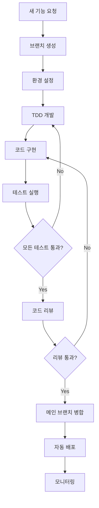
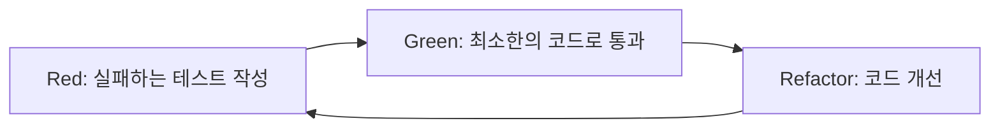
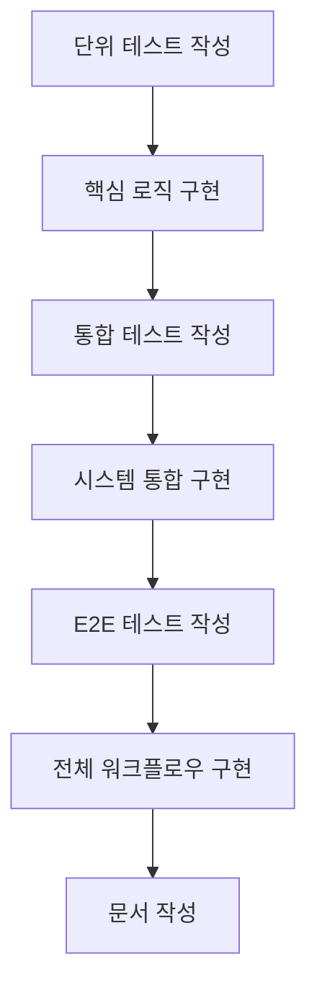

# MLOps 프로젝트 개발 워크플로우 가이드

## 🎯 개요

이 문서는 MLOps 프로젝트에서 사용할 표준화된 개발 워크플로우를 정의합니다. 새로운 기능 개발부터 테스트, 배포까지의 전체 프로세스를 단계별로 안내합니다.

## 🔄 전체 개발 워크플로우



## 🌿 1. 브랜치 생성 및 명명

### 1.1 브랜치 생성 프로세스

```bash
# 1. 최신 main 브랜치 동기화
git checkout main
git pull origin main

# 2. 브랜치명 검증 (선택사항)
./scripts/validate_branch_name.sh feature/stage6-monitoring-dashboard

# 3. 새 브랜치 생성 및 체크아웃
git checkout -b feature/stage6-monitoring-dashboard

# 4. 원격 브랜치에 푸시
git push -u origin feature/stage6-monitoring-dashboard
```

### 1.2 브랜치 타입별 가이드

| 브랜치 타입 | 언제 사용 | 명명 규칙 | 병합 전략 |
|-------------|-----------|-----------|-----------|
| **feature/stage<N>-*** | MLOps 9단계 기능 개발 | `feature/stage6-monitoring-api` | PR → main |
| **experiment/*** | ML 실험 및 연구 | `experiment/hyperparameter-tuning` | 보통 병합하지 않음 |
| **bugfix/*** | 버그 수정 | `bugfix/123-memory-leak` | PR → main |
| **hotfix/*** | 긴급 수정 | `hotfix/456-security-patch` | 직접 main 병합 |
| **docs/*** | 문서 작업 | `docs/api-documentation` | PR → main |

## 🔧 2. 환경 설정 워크플로우

### 2.1 신규 단계(X.Y) 시작 시

```bash
# 1. 초기 설정 실행
./run_tests.sh --setup

# 2. 단계별 환경 설정 (있는 경우)
bash scripts/setup/setup_stage_X.sh

# 3. Docker 환경 확인
docker compose -f docker/docker-compose.main.yml ps

# 4. 테스트 환경 검증
./run_tests.sh --wsl unit
```

### 2.3 환경 변수 관리

**✅ .env 파일 자동 로드 시스템**

현재 프로젝트는 `.env` 파일에서 환경 변수를 자동으로 로드하도록 개선되었습니다.

```bash
# 더 이상 수동 환경 변수 설정 불필요!
cd /mnt/c/dev/movie-mlops

# .env 파일에서 자동 로드됨
bash scripts/test/run_3_1_tests.sh all
```

**환경 변수 설정 방법**:

1. **기본 설정 (.env 파일)**:
   ```bash
   # MLOps 테스트 환경 설정
   MLOPS_PROJECT_ROOT=/mnt/c/dev/movie-mlops
   TEST_MODE=true
   WSL_DISTRO_NAME=Ubuntu
   
   # 단계별 환경 설정
   FEATURE_STORE_ENABLED=true  # 2단계
   MODEL_SERVING_PORT=8080     # 5단계
   MONITORING_ENABLED=true     # 6단계
   ```

2. **단계별 환경 설정**:
   ```bash
   # 1-2단계: 데이터 파이프라인 & 피처 스토어
   DATA_DIR=data
   FEATURE_STORE_BASE_PATH=/app/data/feature_store
   
   # 3-4단계: 버전 관리 & CI/CD
   GIT_DEFAULT_BRANCH=main
   CICD_PIPELINE_ENABLED=true
   
   # 5-6단계: 모델 서빙 & 모니터링
   MODEL_SERVING_HOST=0.0.0.0
   PROMETHEUS_PORT=9090
   GRAFANA_PORT=3000
   
   # 7-8단계: 보안 & 확장성
   SECURITY_SCAN_ENABLED=true
   LOAD_BALANCER_ENABLED=true
   
   # 9단계: 이벤트 드리븐
   EVENT_STREAMING_ENABLED=true
   ```

3. **환경별 설정 파일**:
   ```bash
   # 개발 환경
   cp .env.template .env.development
   
   # 운영 환경  
   cp .env.template .env.production
   
   # 테스트 환경
   cp .env.template .env.testing
   ```

4. **환경 변수 확인**:
   ```bash
   # 현재 로드된 환경 변수 확인
   env | grep MLOPS
   env | grep TEST_MODE
   
   # .env 파일 내용 확인
   cat .env | grep -v '^#' | grep -v '^

```bash
# 1. 의존성 업데이트
pip install -r requirements-dev.txt

# 2. 환경 변수 확인
cp .env.template .env  # 필요시
# .env 파일에서 필요한 값들 설정

# 3. 빠른 환경 검증
python -c "import src; print('Environment OK')"
```

## 🧪 3. 테스트 주도 개발 (TDD) 워크플로우

### 3.1 TDD 사이클



### 3.2 단계별 TDD 구현

**Step 1: 실패하는 테스트 작성**
```bash
# 테스트 파일 생성
touch tests/unit/test_6_1_monitoring_api.py

# 테스트 코드 작성 (실패하도록)
```

```python
# tests/unit/test_6_1_monitoring_api.py
import pytest
from src.monitoring.api import MonitoringAPI

def test_monitoring_api_health_check():
    """모니터링 API 헬스체크 테스트"""
    api = MonitoringAPI()
    response = api.health_check()
    assert response.status_code == 200
    assert response.data["status"] == "healthy"
```

**Step 2: 테스트 실행 (Red)**
```bash
python -m pytest tests/unit/test_6_1_monitoring_api.py -v
# 예상: FAILED (모듈이 없으므로)
```

**Step 3: 최소한의 코드 작성 (Green)**
```python
# src/monitoring/api.py
class Response:
    def __init__(self, status_code, data):
        self.status_code = status_code
        self.data = data

class MonitoringAPI:
    def health_check(self):
        return Response(200, {"status": "healthy"})
```

**Step 4: 테스트 통과 확인**
```bash
python -m pytest tests/unit/test_6_1_monitoring_api.py -v
# 예상: PASSED
```

**Step 5: 리팩토링 및 추가 테스트**
```bash
# 전체 테스트 실행으로 회귀 확인
./run_tests.sh --wsl unit
```

### 3.3 테스트 레벨별 개발 순서

```bash
# 1. 단위 테스트 (가장 빠름)
python -m pytest tests/unit/test_6_1_*.py -v

# 2. 통합 테스트 (의존성 포함)
python -m pytest tests/integration/test_6_1_*.py -v

# 3. E2E 테스트 (전체 워크플로우)
python -m pytest tests/e2e/test_6_1_*.py -v

# 4. 전체 테스트 실행
./run_tests.sh --wsl all
```

## 💻 4. 코드 구현 워크플로우

### 4.1 구현 순서



### 4.2 파일 생성 패턴

**새로운 기능 구현 시:**
```bash
# 1. 디렉터리 구조 생성
mkdir -p src/monitoring/{api,collectors,alerts}
mkdir -p tests/{unit,integration,e2e}

# 2. 핵심 파일들 생성
touch src/monitoring/__init__.py
touch src/monitoring/api.py
touch src/monitoring/collectors/metrics_collector.py
touch src/monitoring/alerts/alert_manager.py

# 3. 설정 파일 생성
touch config/monitoring_config.yaml
touch docker/docker-compose.monitoring.yml

# 4. 테스트 파일 생성
touch tests/unit/test_6_1_monitoring_api.py
touch tests/integration/test_6_1_monitoring_system.py
touch tests/e2e/test_6_1_complete_monitoring.py

# 5. 문서 파일 생성
touch docs/06-monitoring/6.1-monitoring-api-implementation.md
```

### 4.3 코드 품질 체크

```bash
# 코드 포맷팅
black src/ tests/
isort src/ tests/

# 린팅
flake8 src/ tests/
pylint src/

# 타입 체크
mypy src/

# 보안 스캔
bandit -r src/

# 전체 품질 체크 (Pre-commit)
pre-commit run --all-files
```

## 🔍 5. 코드 리뷰 프로세스

### 5.1 Pull Request 생성

```bash
# 1. 모든 테스트 통과 확인
./run_tests.sh --wsl all

# 2. 코드 정리 및 커밋
git add .
git commit -m "feat(stage6): implement monitoring API

- Add health check endpoint
- Implement metrics collection
- Add alert management system
- Include comprehensive testing

Fixes #123"

# 3. 원격 브랜치에 푸시
git push origin feature/stage6-monitoring-dashboard

# 4. GitHub에서 PR 생성
```

### 5.2 PR 템플릿

```markdown
## 📋 변경 사항
- [ ] 새 기능: 모니터링 API 구현
- [ ] 버그 수정: 메모리 누수 해결
- [ ] 문서 업데이트: API 가이드 추가

## 🧪 테스트
- [ ] 단위 테스트 통과
- [ ] 통합 테스트 통과
- [ ] E2E 테스트 통과
- [ ] 브라우저 테스트 완료 (해당시)

## 📊 성능 영향
- [ ] 성능 저하 없음
- [ ] 메모리 사용량 측정 완료
- [ ] 응답 시간 벤치마크 완료

## 🔗 관련 이슈
Closes #123
Related to #456

## 📝 리뷰어 체크리스트
- [ ] 코드 스타일 가이드 준수
- [ ] 테스트 커버리지 충분
- [ ] 문서 업데이트 필요시 완료
- [ ] 보안 고려사항 검토
```

### 5.3 리뷰 체크포인트

**자동 체크 (GitHub Actions)**:
- [ ] 모든 테스트 통과
- [ ] 코드 품질 체크 통과
- [ ] 보안 스캔 통과
- [ ] 문서 빌드 성공

**수동 리뷰 포인트**:
- [ ] 비즈니스 로직 정확성
- [ ] 에러 처리 적절성
- [ ] 코드 가독성 및 maintainability
- [ ] 아키텍처 일관성

## 🚀 6. 배포 워크플로우

### 6.1 자동 배포 파이프라인


### 6.2 수동 배포 명령어

```bash
# 1. Staging 환경 배포
bash scripts/deploy/deploy_staging.sh

# 2. 배포 확인
curl http://staging.example.com/health

# 3. Production 배포 (승인 후)
bash scripts/deploy/deploy_production.sh

# 4. 롤백 (필요시)
bash scripts/deploy/rollback.sh v1.2.0
```

### 6.3 단계별 배포 전략

| 단계 | 배포 대상 | 배포 방식 | 모니터링 |
|------|-----------|-----------|----------|
| **1-2단계** | 데이터 파이프라인 | Cron Job | 로그 모니터링 |
| **3-4단계** | CI/CD 도구 | Infrastructure | 파이프라인 메트릭 |
| **5단계** | API 서버 | Blue-Green | API 메트릭 |
| **6단계** | 모니터링 시스템 | Canary | 시스템 메트릭 |
| **7-8단계** | 보안/확장성 | Rolling | 보안/성능 메트릭 |
| **9단계** | 이벤트 시스템 | Event-driven | 이벤트 메트릭 |

## 📊 7. 모니터링 및 피드백

### 7.1 개발 메트릭 추적

```bash
# 코드 품질 메트릭
echo "Test Coverage: $(coverage report | tail -1 | awk '{print $4}')"
echo "Code Quality: $(pylint src/ | grep 'rated at' | awk '{print $7}')"

# 개발 속도 메트릭
git log --oneline --since="1 week ago" | wc -l  # 주간 커밋 수
git log --shortstat --since="1 week ago" | grep "files changed"  # 변경 통계
```

### 7.2 배포 후 확인사항

```bash
# 1. 서비스 상태 확인
curl http://api.example.com/health

# 2. 로그 확인
docker logs mlops-api-prod --tail 100

# 3. 메트릭 확인 (Prometheus/Grafana)
curl http://monitoring.example.com/metrics

# 4. 에러율 확인
grep "ERROR" logs/app.log | wc -l
```

## 🔧 8. 도구 및 자동화

### 8.1 개발 도구 설정

```bash
# VS Code 설정 권장사항
{
  "python.defaultInterpreterPath": "./venv/bin/python",
  "python.linting.enabled": true,
  "python.linting.pylintEnabled": true,
  "python.formatting.provider": "black",
  "editor.formatOnSave": true
}

# Git 훅 설정
pre-commit install
```

### 8.2 자동화 스크립트

```bash
# 일일 개발 시작 스크립트
#!/bin/bash
# scripts/daily_start.sh
git checkout main
git pull origin main
docker compose -f docker/docker-compose.main.yml up -d
./run_tests.sh --wsl unit

# 일일 개발 종료 스크립트  
#!/bin/bash
# scripts/daily_end.sh
git add .
git commit -m "WIP: $(date)"
git push origin $(git branch --show-current)
docker compose -f docker/docker-compose.main.yml down
```

## 📚 9. 단계별 워크플로우 예시

### 9.1 Stage 3 (버전 관리) 워크플로우

```bash
# 1. 브랜치 생성
git checkout -b feature/stage3-git-workflow

# 2. 테스트 작성
touch tests/unit/test_3_1_git_config.py

# 3. 구현
touch scripts/validate_branch_name.sh
touch scripts/setup/setup_mlops_git.sh

# 4. 테스트 실행
./run_tests.sh --wsl all

# 5. 문서 작성
touch docs/03-version-control/3.1-git-workflow-implementation.md

# 6. PR 생성 및 리뷰
git push origin feature/stage3-git-workflow
```

### 9.2 Stage 6 (모니터링) 워크플로우

```bash
# 1. 모니터링 환경 설정
bash scripts/setup/setup_monitoring.sh

# 2. Docker 환경 구성
docker compose -f docker/docker-compose.monitoring.yml up -d

# 3. 모니터링 API 개발
# TDD로 API 개발

# 4. 대시보드 구성
# Grafana 대시보드 설정

# 5. 알림 시스템 구현
# Alert Manager 설정

# 6. E2E 테스트
./run_tests.sh --wsl e2e
```

## ✅ 워크플로우 체크리스트

### 🔄 일반 개발 워크플로우
- [ ] 브랜치명 규칙 준수
- [ ] TDD 사이클 적용
- [ ] 모든 테스트 통과
- [ ] 코드 리뷰 완료
- [ ] 문서 업데이트

### 🧪 테스트 워크플로우
- [ ] 단위 테스트 먼저 작성
- [ ] 통합 테스트 추가
- [ ] E2E 테스트 완성
- [ ] 성능 테스트 (필요시)
- [ ] 보안 테스트 (7단계+)

### 🚀 배포 워크플로우
- [ ] Staging 환경 검증
- [ ] 모니터링 설정 완료
- [ ] 롤백 계획 수립
- [ ] Production 배포
- [ ] 배포 후 검증

## 📚 관련 문서

- [디렉터리 구조 표준](./directory-structure.md)
- [네이밍 컨벤션](./naming-conventions.md)
- [Git 워크플로우 구현](../03-version-control/3.1-git-workflow-implementation.md)
- [테스트 전략 문서](../03-version-control/testing/)

---

**📌 참고**: 이 워크플로우는 프로젝트 진행에 따라 지속적으로 개선됩니다. 새로운 도구나 프로세스가 도입되면 이 문서를 업데이트해주세요.

   ```

**⚠️ 주의사항**:
- `.env` 파일은 Git에 커밋되지만, 민감한 정보(예: API 키)는 주의
- `.env.template` 파일을 참조하여 필요한 변수들 설정
- 단계별로 필요한 환경 변수만 활성화

### 2.2 기존 단계 작업 시

```bash
# 1. 의존성 업데이트
pip install -r requirements-dev.txt

# 2. 환경 변수 확인
cp .env.template .env  # 필요시
# .env 파일에서 필요한 값들 설정

# 3. 빠른 환경 검증
python -c "import src; print('Environment OK')"
```

## 🧪 3. 테스트 주도 개발 (TDD) 워크플로우

### 3.1 TDD 사이클


### 3.2 단계별 TDD 구현

**Step 1: 실패하는 테스트 작성**
```bash
# 테스트 파일 생성
touch tests/unit/test_6_1_monitoring_api.py

# 테스트 코드 작성 (실패하도록)
```

```python
# tests/unit/test_6_1_monitoring_api.py
import pytest
from src.monitoring.api import MonitoringAPI

def test_monitoring_api_health_check():
    """모니터링 API 헬스체크 테스트"""
    api = MonitoringAPI()
    response = api.health_check()
    assert response.status_code == 200
    assert response.data["status"] == "healthy"
```

**Step 2: 테스트 실행 (Red)**
```bash
python -m pytest tests/unit/test_6_1_monitoring_api.py -v
# 예상: FAILED (모듈이 없으므로)
```

**Step 3: 최소한의 코드 작성 (Green)**
```python
# src/monitoring/api.py
class Response:
    def __init__(self, status_code, data):
        self.status_code = status_code
        self.data = data

class MonitoringAPI:
    def health_check(self):
        return Response(200, {"status": "healthy"})
```

**Step 4: 테스트 통과 확인**
```bash
python -m pytest tests/unit/test_6_1_monitoring_api.py -v
# 예상: PASSED
```

**Step 5: 리팩토링 및 추가 테스트**
```bash
# 전체 테스트 실행으로 회귀 확인
./run_tests.sh --wsl unit
```

### 3.3 테스트 레벨별 개발 순서

```bash
# 1. 단위 테스트 (가장 빠름)
python -m pytest tests/unit/test_6_1_*.py -v

# 2. 통합 테스트 (의존성 포함)
python -m pytest tests/integration/test_6_1_*.py -v

# 3. E2E 테스트 (전체 워크플로우)
python -m pytest tests/e2e/test_6_1_*.py -v

# 4. 전체 테스트 실행
./run_tests.sh --wsl all
```

## 💻 4. 코드 구현 워크플로우

### 4.1 구현 순서


### 4.2 파일 생성 패턴

**새로운 기능 구현 시:**
```bash
# 1. 디렉터리 구조 생성
mkdir -p src/monitoring/{api,collectors,alerts}
mkdir -p tests/{unit,integration,e2e}

# 2. 핵심 파일들 생성
touch src/monitoring/__init__.py
touch src/monitoring/api.py
touch src/monitoring/collectors/metrics_collector.py
touch src/monitoring/alerts/alert_manager.py

# 3. 설정 파일 생성
touch config/monitoring_config.yaml
touch docker/docker-compose.monitoring.yml

# 4. 테스트 파일 생성
touch tests/unit/test_6_1_monitoring_api.py
touch tests/integration/test_6_1_monitoring_system.py
touch tests/e2e/test_6_1_complete_monitoring.py

# 5. 문서 파일 생성
touch docs/06-monitoring/6.1-monitoring-api-implementation.md
```

### 4.3 코드 품질 체크

```bash
# 코드 포맷팅
black src/ tests/
isort src/ tests/

# 린팅
flake8 src/ tests/
pylint src/

# 타입 체크
mypy src/

# 보안 스캔
bandit -r src/

# 전체 품질 체크 (Pre-commit)
pre-commit run --all-files
```

## 🔍 5. 코드 리뷰 프로세스

### 5.1 Pull Request 생성

```bash
# 1. 모든 테스트 통과 확인
./run_tests.sh --wsl all

# 2. 코드 정리 및 커밋
git add .
git commit -m "feat(stage6): implement monitoring API

- Add health check endpoint
- Implement metrics collection
- Add alert management system
- Include comprehensive testing

Fixes #123"

# 3. 원격 브랜치에 푸시
git push origin feature/stage6-monitoring-dashboard

# 4. GitHub에서 PR 생성
```

### 5.2 PR 템플릿

```markdown
## 📋 변경 사항
- [ ] 새 기능: 모니터링 API 구현
- [ ] 버그 수정: 메모리 누수 해결
- [ ] 문서 업데이트: API 가이드 추가

## 🧪 테스트
- [ ] 단위 테스트 통과
- [ ] 통합 테스트 통과
- [ ] E2E 테스트 통과
- [ ] 브라우저 테스트 완료 (해당시)

## 📊 성능 영향
- [ ] 성능 저하 없음
- [ ] 메모리 사용량 측정 완료
- [ ] 응답 시간 벤치마크 완료

## 🔗 관련 이슈
Closes #123
Related to #456

## 📝 리뷰어 체크리스트
- [ ] 코드 스타일 가이드 준수
- [ ] 테스트 커버리지 충분
- [ ] 문서 업데이트 필요시 완료
- [ ] 보안 고려사항 검토
```

### 5.3 리뷰 체크포인트

**자동 체크 (GitHub Actions)**:
- [ ] 모든 테스트 통과
- [ ] 코드 품질 체크 통과
- [ ] 보안 스캔 통과
- [ ] 문서 빌드 성공

**수동 리뷰 포인트**:
- [ ] 비즈니스 로직 정확성
- [ ] 에러 처리 적절성
- [ ] 코드 가독성 및 maintainability
- [ ] 아키텍처 일관성

## 🚀 6. 배포 워크플로우

### 6.1 자동 배포 파이프라인


### 6.2 수동 배포 명령어

```bash
# 1. Staging 환경 배포
bash scripts/deploy/deploy_staging.sh

# 2. 배포 확인
curl http://staging.example.com/health

# 3. Production 배포 (승인 후)
bash scripts/deploy/deploy_production.sh

# 4. 롤백 (필요시)
bash scripts/deploy/rollback.sh v1.2.0
```

### 6.3 단계별 배포 전략

| 단계 | 배포 대상 | 배포 방식 | 모니터링 |
|------|-----------|-----------|----------|
| **1-2단계** | 데이터 파이프라인 | Cron Job | 로그 모니터링 |
| **3-4단계** | CI/CD 도구 | Infrastructure | 파이프라인 메트릭 |
| **5단계** | API 서버 | Blue-Green | API 메트릭 |
| **6단계** | 모니터링 시스템 | Canary | 시스템 메트릭 |
| **7-8단계** | 보안/확장성 | Rolling | 보안/성능 메트릭 |
| **9단계** | 이벤트 시스템 | Event-driven | 이벤트 메트릭 |

## 📊 7. 모니터링 및 피드백

### 7.1 개발 메트릭 추적

```bash
# 코드 품질 메트릭
echo "Test Coverage: $(coverage report | tail -1 | awk '{print $4}')"
echo "Code Quality: $(pylint src/ | grep 'rated at' | awk '{print $7}')"

# 개발 속도 메트릭
git log --oneline --since="1 week ago" | wc -l  # 주간 커밋 수
git log --shortstat --since="1 week ago" | grep "files changed"  # 변경 통계
```

### 7.2 배포 후 확인사항

```bash
# 1. 서비스 상태 확인
curl http://api.example.com/health

# 2. 로그 확인
docker logs mlops-api-prod --tail 100

# 3. 메트릭 확인 (Prometheus/Grafana)
curl http://monitoring.example.com/metrics

# 4. 에러율 확인
grep "ERROR" logs/app.log | wc -l
```

## 🔧 8. 도구 및 자동화

### 8.1 개발 도구 설정

```bash
# VS Code 설정 권장사항
{
  "python.defaultInterpreterPath": "./venv/bin/python",
  "python.linting.enabled": true,
  "python.linting.pylintEnabled": true,
  "python.formatting.provider": "black",
  "editor.formatOnSave": true
}

# Git 훅 설정
pre-commit install
```

### 8.2 자동화 스크립트

```bash
# 일일 개발 시작 스크립트
#!/bin/bash
# scripts/daily_start.sh
git checkout main
git pull origin main
docker compose -f docker/docker-compose.main.yml up -d
./run_tests.sh --wsl unit

# 일일 개발 종료 스크립트  
#!/bin/bash
# scripts/daily_end.sh
git add .
git commit -m "WIP: $(date)"
git push origin $(git branch --show-current)
docker compose -f docker/docker-compose.main.yml down
```

## 📚 9. 단계별 워크플로우 예시

### 9.1 Stage 3 (버전 관리) 워크플로우

```bash
# 1. 브랜치 생성
git checkout -b feature/stage3-git-workflow

# 2. 테스트 작성
touch tests/unit/test_3_1_git_config.py

# 3. 구현
touch scripts/validate_branch_name.sh
touch scripts/setup/setup_mlops_git.sh

# 4. 테스트 실행
./run_tests.sh --wsl all

# 5. 문서 작성
touch docs/03-version-control/3.1-git-workflow-implementation.md

# 6. PR 생성 및 리뷰
git push origin feature/stage3-git-workflow
```

### 9.2 Stage 6 (모니터링) 워크플로우

```bash
# 1. 모니터링 환경 설정
bash scripts/setup/setup_monitoring.sh

# 2. Docker 환경 구성
docker compose -f docker/docker-compose.monitoring.yml up -d

# 3. 모니터링 API 개발
# TDD로 API 개발

# 4. 대시보드 구성
# Grafana 대시보드 설정

# 5. 알림 시스템 구현
# Alert Manager 설정

# 6. E2E 테스트
./run_tests.sh --wsl e2e
```

## ✅ 워크플로우 체크리스트

### 🔄 일반 개발 워크플로우
- [ ] 브랜치명 규칙 준수
- [ ] TDD 사이클 적용
- [ ] 모든 테스트 통과
- [ ] 코드 리뷰 완료
- [ ] 문서 업데이트

### 🧪 테스트 워크플로우
- [ ] 단위 테스트 먼저 작성
- [ ] 통합 테스트 추가
- [ ] E2E 테스트 완성
- [ ] 성능 테스트 (필요시)
- [ ] 보안 테스트 (7단계+)

### 🚀 배포 워크플로우
- [ ] Staging 환경 검증
- [ ] 모니터링 설정 완료
- [ ] 롤백 계획 수립
- [ ] Production 배포
- [ ] 배포 후 검증

## 📚 관련 문서

- [디렉터리 구조 표준](./directory-structure.md)
- [네이밍 컨벤션](./naming-conventions.md)
- [Git 워크플로우 구현](../03-version-control/3.1-git-workflow-implementation.md)
- [테스트 전략 문서](../03-version-control/testing/)

---

**📌 참고**: 이 워크플로우는 프로젝트 진행에 따라 지속적으로 개선됩니다. 새로운 도구나 프로세스가 도입되면 이 문서를 업데이트해주세요.
