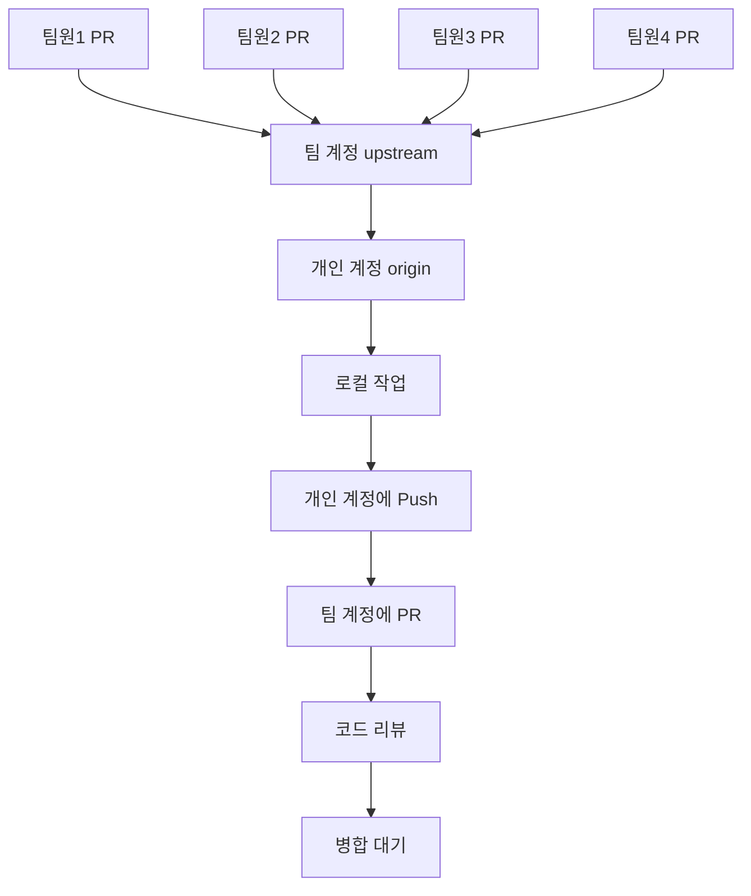

# Git Fork/PR 워크플로우 완전 가이드 🚀

## 📋 전체 워크플로우 개요



**워크플로우 핵심:**
- **upstream**: 팀 계정 (AIBootcamp13)
- **origin**: 개인 계정 (YOUR_USERNAME)
- **local**: 로컬 작업 환경
- **PR**: Pull Request를 통한 코드 기여

---

## 1️⃣ 현재 폴더 Git 원격 저장소 설정

### 📍 현재 Git 상태 확인

```bash
# movie-mlops 폴더에서 실행
git remote -v
```

### 🔧 원격 저장소 재설정

```bash
# 기존 origin 제거 (있다면)
git remote remove origin

# 내 개인 계정을 origin으로 설정
git remote add origin https://github.com/YOUR_USERNAME/mlops-cloud-project-mlops_11.git

# 팀 계정을 upstream으로 설정  
git remote add upstream https://github.com/AIBootcamp13/mlops-cloud-project-mlops_11.git

# 설정 확인
git remote -v
```

**✅ 예상 출력:**
```
origin    https://github.com/YOUR_USERNAME/mlops-cloud-project-mlops_11.git (fetch)
origin    https://github.com/YOUR_USERNAME/mlops-cloud-project-mlops_11.git (push)
upstream  https://github.com/AIBootcamp13/mlops-cloud-project-mlops_11.git (fetch)
upstream  https://github.com/AIBootcamp13/mlops-cloud-project-mlops_11.git (push)
```

### 🔄 최신 코드로 동기화

```bash
# 팀 계정에서 최신 코드 가져오기
git fetch upstream

# 현재 브랜치 확인
git branch

# main 브랜치로 이동 (없다면 생성)
git checkout main
# 또는 git checkout -b main

# 팀 계정의 main을 내 로컬에 반영
git reset --hard upstream/main

# 내 개인 계정에도 최신 상태로 푸시
git push origin main --force
```

**⚠️ 주의사항:**
- `--force` 옵션은 첫 설정 시에만 사용
- 이후에는 `git merge upstream/main` 사용 권장

---

## 2️⃣ 개인 작업 → 개인 계정 → 팀 계정 PR 워크플로우

### 🌿 작업 브랜치 생성

```bash
# 새로운 기능 브랜치 생성 (예: feature/data-pipeline)
git checkout -b feature/data-pipeline

# 또는 이슈 기반 브랜치 (예: issue-15-api-connector)
git checkout -b issue-15-api-connector
```

**📝 브랜치 명명 규칙:**
- `feature/기능명`: 새로운 기능 개발
- `fix/버그명`: 버그 수정
- `docs/문서명`: 문서 작성/수정
- `refactor/모듈명`: 코드 리팩토링
- `test/테스트명`: 테스트 코드 작성

### ✏️ 코드 작업 후 개인 계정에 푸시

```bash
# 변경된 파일 확인
git status

# 모든 변경 사항 스테이징
git add .

# 또는 특정 파일만
git add src/data_processing/new_feature.py

# 의미있는 커밋 메시지로 커밋
git commit -m "feat: TMDB API 연동 기능 구현

- TMDBConnector 클래스 추가
- Rate limiting 처리 로직 구현
- 환경변수 기반 설정 관리
- 단위 테스트 코드 작성

Closes #15"

# 내 개인 계정에 푸시
git push origin feature/data-pipeline
```

**📋 커밋 메시지 컨벤션:**
```
타입: 간단한 설명

상세 설명 (선택사항)
- 변경사항 1
- 변경사항 2
- 변경사항 3

Closes #이슈번호
```

**커밋 타입:**
- `feat`: 새로운 기능
- `fix`: 버그 수정
- `docs`: 문서 변경
- `style`: 코드 포맷팅
- `refactor`: 코드 리팩토링
- `test`: 테스트 추가/수정
- `chore`: 빌드 과정 또는 보조 도구 변경

### 🔀 팀 계정에 Pull Request 생성

**GitHub 웹에서 PR 생성:**

1. **내 개인 계정** 저장소로 이동
2. **"Contribute" → "Open pull request"** 클릭
3. **Base repository**: `AIBootcamp13/mlops-cloud-project-mlops_11` 
4. **Base branch**: `main`
5. **Head repository**: `YOUR_USERNAME/mlops-cloud-project-mlops_11`
6. **Compare branch**: `feature/data-pipeline`

**📝 PR 제목 및 설명 템플릿:**
```markdown
feat: TMDB API 연동 기능 구현

## 📋 변경 사항
- TMDBConnector 클래스 추가
- Rate limiting 처리 로직 구현
- 환경변수 기반 설정 관리

## 🧪 테스트
- [x] 단위 테스트 통과
- [x] 통합 테스트 실행
- [x] 코드 품질 검사 통과

## 📝 체크리스트
- [x] 코드 리뷰 준비 완료
- [x] 문서 업데이트 완료
- [x] 테스트 커버리지 80% 이상

## 📸 스크린샷 (UI 변경 시)
<!-- 스크린샷 첨부 -->

## 🔗 관련 이슈
Closes #15

## 👀 리뷰어
@teammate1 @teammate2
```

---

## 3️⃣ 팀 계정에서 PR 병합 (나중에 할 작업)

### 🔍 PR 리뷰 및 병합 프로세스

**GitHub 웹에서 (팀 계정 관리자):**

1. **팀 계정** `AIBootcamp13/mlops-cloud-project-mlops_11`로 이동
2. **"Pull requests"** 탭 클릭
3. **리뷰할 PR** 선택
4. **Files changed** 탭에서 코드 리뷰
5. **Review** 작성:
   - **Comment**: 일반적인 피드백
   - **Approve**: 승인
   - **Request changes**: 수정 요청

**병합 옵션 (나중에 사용):**
- **Create a merge commit**: 병합 커밋 생성
- **Squash and merge**: 여러 커밋을 하나로 합침 (권장)
- **Rebase and merge**: 선형 히스토리 유지

---

## 4️⃣ 다른 팀원 PR 확인을 위한 별도 폴더 설정

### 📁 팀원별 폴더 생성 구조

```bash
# 상위 폴더로 이동
cd ..

# 팀원별 폴더 생성
mkdir teammate1-work teammate2-work teammate3-work teammate4-work

# 폴더 구조 확인
ls -la
```

**🗂️ 최종 폴더 구조:**
```
dev/
├── movie-mlops/                    # 내 주요 작업 폴더
├── teammate1-work/                 # 팀원1 작업 확인용
├── teammate2-work/                 # 팀원2 작업 확인용
├── teammate3-work/                 # 팀원3 작업 확인용
└── teammate4-work/                 # 팀원4 작업 확인용
```

### 🔗 각 팀원 작업 확인 방법

**teammate1 작업 확인:**
```bash
cd teammate1-work

# 팀 계정에서 클론
git clone https://github.com/AIBootcamp13/mlops-cloud-project-mlops_11.git .

# teammate1이 만든 PR 브랜치 확인
git fetch origin

# 모든 브랜치 조회 (원격 포함)
git branch -a

# teammate1의 PR 브랜치로 전환 (예: feature/teammate1-feature)
git checkout -b teammate1-feature origin/teammate1-feature

# teammate1의 작업 내용 확인
git log --oneline -10
ls -la
```

**teammate2 작업 확인:**
```bash
cd ../teammate2-work

git clone https://github.com/AIBootcamp13/mlops-cloud-project-mlops_11.git .
git fetch origin
git checkout -b teammate2-feature origin/teammate2-feature
```

### 🔍 PR 브랜치 찾는 유용한 명령어

```bash
# 팀 계정의 모든 브랜치 확인
git ls-remote --heads origin

# 특정 패턴으로 브랜치 찾기
git branch -r | grep feature
git branch -r | grep fix
git branch -r | grep docs

# 최근 생성된 브랜치들 확인
git for-each-ref --sort=-committerdate refs/remotes --format='%(refname:short) %(committerdate:short)'

# 브랜치별 최근 커밋 확인
git for-each-ref --sort=-committerdate refs/remotes --format='%(refname:short) %(subject)'
```

---

## 5️⃣ 일일 워크플로우 루틴

### 🌅 작업 시작 전 루틴 (movie-mlops 폴더에서)

```bash
# 1. 팀 계정에서 최신 변경사항 가져오기
git fetch upstream

# 2. main 브랜치로 이동
git checkout main

# 3. 팀 계정의 최신 코드와 동기화
git merge upstream/main

# 4. 내 개인 계정에도 동기화
git push origin main

# 5. 현재 상태 확인
git status
git log --oneline -5
```

### 🛠️ 새로운 작업 시작

```bash
# 1. 새로운 기능 브랜치 생성
git checkout -b feature/new-functionality

# 2. 작업 수행
# ... 코딩 작업 ...

# 3. 변경사항 확인
git status
git diff

# 4. 스테이징 및 커밋
git add .
git commit -m "feat: 새로운 기능 구현

- 기능 A 추가
- 기능 B 개선
- 테스트 코드 작성

Closes #이슈번호"

# 5. 개인 계정에 푸시
git push origin feature/new-functionality
```

### 🌆 작업 완료 후

```bash
# GitHub에서 PR 생성
# 1. 개인 계정 저장소 방문
# 2. "Compare & pull request" 클릭
# 3. PR 템플릿 작성
# 4. "Create pull request" 클릭
```

### 👥 팀원 작업 확인 시

```bash
# teammate1 최신 작업 확인
cd ../teammate1-work
git fetch origin

# 새로운 브랜치 확인
git branch -r --sort=-committerdate | head -5

# 특정 브랜치로 전환
git checkout -b latest-work origin/feature/teammate1-latest

# teammate2 작업 확인  
cd ../teammate2-work
git fetch origin
git checkout -b teammate2-latest origin/feature/teammate2-work
```

---

## 6️⃣ 고급 Git 명령어 및 팁

### 🔄 Fork 동기화 (정기적으로 실행)

```bash
# movie-mlops 폴더에서 정기 동기화
git fetch upstream
git checkout main
git merge upstream/main
git push origin main

# 충돌 발생 시 해결
git status
# 충돌 파일 수동 편집
git add .
git commit -m "fix: merge conflict 해결"
```

### 🌿 브랜치 관리

```bash
# 로컬 브랜치 목록
git branch

# 원격 브랜치 포함 모든 브랜치
git branch -a

# 작업 완료된 브랜치 삭제
git branch -d feature/completed-work
git push origin --delete feature/completed-work

# 브랜치 이름 변경
git branch -m old-branch-name new-branch-name
```

### 📊 변경사항 확인 및 비교

```bash
# 팀 계정과 내 로컬의 차이점 확인
git diff upstream/main..HEAD

# 특정 팀원 브랜치와 비교
git diff origin/teammate1-feature..HEAD

# 커밋 히스토리 그래프로 보기
git log --graph --oneline --all

# 특정 파일의 변경 히스토리
git log --follow -p -- src/data_processing/api.py

# 브랜치 간 파일 차이점 확인
git diff main..feature/new-work -- src/
```

### 🔧 유용한 Git 설정

```bash
# Git 사용자 정보 설정
git config user.name "Your Name"
git config user.email "your.email@example.com"

# 유용한 Git aliases 설정
git config --global alias.st status
git config --global alias.co checkout
git config --global alias.br branch
git config --global alias.cm commit
git config --global alias.lg "log --graph --oneline --all"

# 기본 에디터 설정 (예: VSCode)
git config --global core.editor "code --wait"
```

---

## 7️⃣ 트러블슈팅 가이드

### 🚨 자주 발생하는 문제들

#### **문제 1: Push 권한 거부**
```bash
# 오류: Permission denied (publickey)
# 해결: SSH 키 확인 또는 HTTPS 사용
git remote set-url origin https://github.com/YOUR_USERNAME/mlops-cloud-project-mlops_11.git
```

#### **문제 2: 브랜치가 뒤처져 있음**
```bash
# 오류: Your branch is behind 'origin/main'
# 해결: 최신 코드와 동기화
git pull upstream main
git push origin main
```

#### **문제 3: 커밋 메시지 수정**
```bash
# 마지막 커밋 메시지 수정
git commit --amend -m "새로운 커밋 메시지"

# 이미 푸시한 경우 (주의: force push)
git push origin feature/branch-name --force
```

#### **문제 4: 잘못된 파일 커밋**
```bash
# 마지막 커밋에서 파일 제거
git reset --soft HEAD~1
git reset HEAD unwanted-file.txt
git commit -m "올바른 커밋 메시지"
```

### 🆘 응급 복구 명령어

```bash
# 로컬 변경사항 모두 버리고 원격과 동일하게
git reset --hard upstream/main

# 특정 커밋으로 되돌리기
git reset --hard <commit-hash>

# 실수로 삭제한 브랜치 복구
git reflog
git checkout -b recovered-branch <commit-hash>
```

---

## 8️⃣ 팀 협업 베스트 프랙티스

### ✅ Do's (해야 할 것들)

1. **의미있는 커밋 메시지** 작성
2. **작은 단위로 자주 커밋**
3. **PR 전에 코드 자체 리뷰**
4. **테스트 코드 함께 작성**
5. **문서 업데이트**
6. **브랜치명 규칙 준수**

### ❌ Don'ts (하지 말아야 할 것들)

1. **main 브랜치에 직접 푸시**
2. **의미없는 커밋 메시지**
3. **거대한 커밋 생성**
4. **테스트 없이 PR**
5. **코드 리뷰 없이 병합**
6. **force push 남발**

### 📋 PR 체크리스트

**제출 전 확인사항:**
- [ ] 코드가 정상적으로 동작하는가?
- [ ] 테스트가 모두 통과하는가?
- [ ] 코드 스타일이 일관적인가?
- [ ] 문서가 업데이트되었는가?
- [ ] 불필요한 파일이 포함되지 않았는가?
- [ ] 커밋 메시지가 명확한가?
- [ ] 관련 이슈가 링크되었는가?

---

## 9️⃣ 모니터링 및 관리

### 📊 프로젝트 상태 확인

```bash
# 전체 브랜치 현황
git branch -a --sort=-committerdate

# 팀원별 기여도 확인
git shortlog -sn

# 최근 활동 확인
git log --since="1 week ago" --oneline --all

# 파일별 수정 빈도
git log --format=format: --name-only | egrep -v '^$' | sort | uniq -c | sort -nr
```

### 🔔 알림 및 업데이트

**GitHub 알림 설정:**
1. **Watch** 설정: 팀 저장소를 Watch로 설정
2. **Notification** 관리: Issues, PRs, Discussions 알림 활성화
3. **Email** 설정: 중요한 이벤트는 이메일로 수신

**정기적으로 확인할 것들:**
- 새로운 PR 생성 여부
- 코드 리뷰 요청
- 이슈 업데이트
- 팀원들의 작업 진행상황

---

## 🎯 결론

이 워크플로우를 통해 다음과 같은 이점을 얻을 수 있습니다:

### 🏆 개인 개발자 관점
- **안전한 작업 환경**: 개인 계정에서 자유롭게 실험
- **체계적인 기여**: PR을 통한 구조화된 코드 기여
- **학습 기회**: 팀원들의 코드를 직접 확인하고 학습

### 🤝 팀 협업 관점
- **코드 품질 관리**: 리뷰 프로세스를 통한 품질 보장
- **투명한 개발**: 모든 변경사항이 추적 가능
- **충돌 최소화**: 브랜치 기반 개발로 충돌 방지

### 📈 프로젝트 관리 관점
- **진행상황 가시성**: PR을 통한 진행상황 확인
- **이력 관리**: 모든 변경사항의 완전한 이력 보존
- **롤백 가능**: 문제 발생 시 쉬운 롤백

**🚀 성공적인 협업을 위한 핵심은 일관된 워크플로우 준수입니다!**

---

## 📚 추가 학습 자료

- [Git 공식 문서](https://git-scm.com/docs)
- [GitHub Flow 가이드](https://guides.github.com/introduction/flow/)
- [Conventional Commits](https://www.conventionalcommits.org/)
- [Git 브랜치 전략](https://nvie.com/posts/a-successful-git-branching-model/)

---

**📝 문서 업데이트 이력:**
- 2025-06-04: 초기 문서 작성
- 향후 팀 피드백을 받아 지속적으로 개선 예정